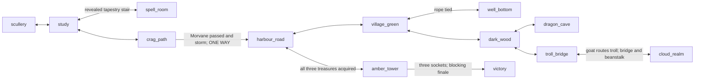

# Crown Quest: Adventure Quality Review

## Release-Polish Follow-Up

Current status: **polished release candidate, pending independent sign-off**.
The troll encounter now shows the goat charge, airborne troll, river splash and
return rather than relying on narration alone. Fennow remains available after
the ring gift; bridge and parchment descriptions reflect solved state. Complete
item/portrait sheets were inspected and the giant portrait's framing corrected.

New touch tests use taps, held d-pad input and classic text submission to reach
the study; portrait and landscape save/restore pass. They exposed missing
landscape controls and clipped tools, both corrected. Offline audio tests verify
37 cue/ambience/mix/mute cases for finite output, non-silence and headroom.
Neither browser emulation nor signal measurements constitute device or listening
certification. Two inherited coverage items are closed; seven engineering items
remain open. [RELEASE_CHECKLIST.md](RELEASE_CHECKLIST.md) provides the blind-test
protocol and explicit human/device release gates. No blind test has been claimed.

Final polish verification: `npm run check` reports **342 passed, 58 intentionally
skipped**, with clean static checks and all 12 rooms at **3.4-11.5 ms/frame**.
The visual suite now has 41 inspected baselines; encounter captures additionally
passed nine zero-tolerance repeat checks after fixing their fixture clock.
The service-worker guard passes against local `HEAD` (`v1.0.7` -> `v1.3.1`);
the default `origin/main` check still skips because that ref lacks the file.

## Post-Review Fixes

The review below is the historical **pre-fix** assessment. The subsequent
implementation request resolved eleven tracked audit items; see the checked
entries and implementation evidence in [BACKLOG.md](BACKLOG.md).

Departure now requires essential supplies. Save eligibility is shared across
entry points; dialogue history, item defaults, ring protection and crag timing
restore consistently. First goat arrival retains the room's bridge geometry.
Natural puzzle verbs and hints agree with progression. Acquisition and scoring
use persistent named events; the 21-event ledger totals exactly 250 before any
clamp (the automatic duel reward changed from 30 to 10). Deposited treasures do
not respawn, and all six socket orders survive intermediate restores.

A new continuous keyboard/parser test wins without injecting progression or
skipping scenes. Input-error coverage now includes parser, walking, exits and
dialogue callbacks; story-specific fallback replies moved out of the engine.
These tests are included in the functional CI command.

Final verification: `npm run check` completed with **328 passed, 46 intentionally
skipped**, clean lint/syntax/content checks, and room frame costs of 6.0-13.9 ms
against the 16 ms target. All 22 state regressions pass in mobile Chromium; the visual
refresh reports 35 passed / 35 intentionally skipped, with all 35 PNG baselines
byte-identical. Browser pixel comparisons and inspected screenshots confirm that
both deposited treasures remain absent from their original locations. The cache
version guard passes against local `HEAD` (`v1.0.7` -> `v1.3.0`); its default
`origin/main` comparison skips because that ref lacks the service-worker file.

The three Critical and three High items from this audit are resolved. Nine older
structural, mobile/touch, visual-portability/coverage and crash-recovery UX items
remain open. Physical touch devices, WebXR hardware and audible sound quality
are not certified by these browser tests. The original scores and release verdict
below are retained for traceability, not presented as a new post-fix review.

## Original Assessment

Review date: 2026-09-06. Scope: the current, substantially modified working tree,
not just HEAD. Review mode: gameplay was not changed. Existing work and historical
completed backlog entries were preserved. Spoilers follow.

## Release Readiness

**Not ready.** A complete solution exists and a keyboard/parser-driven run reached
victory, but ordinary departure, restore and restart actions can make the game
unwinnable. The normal first goat-assisted bridge crossing also stalls.

The existing automated gate is green despite these failures: the completed run
reported **268 passed, 46 skipped**. Passing that suite is not release approval.

## Critical Problems

All findings in this table are **CONFIRMED**, with high confidence. Details,
acceptance criteria, effort and design/debt value are in [BACKLOG.md](BACKLOG.md).

| Priority | Finding | Evidence and player consequence |
|---|---|---|
| Critical | One-way sailing can abandon essential supplies | [act1.js](js/rooms/act1.js#L1539) permits departure without bread/pail; [act2.js](js/rooms/act2.js#L232) refuses return. Runtime arrival without either succeeded. No mainland replacement exists; the dragon's required mirror becomes unattainable without the pail. |
| Critical | Dialogue choices survive restore and restart | [engine.js](js/engine.js#L2213) stores chosenOptions outside saved/reset state. Receive Hattie's rope, restore a pre-gift save: no rope and no option. Restart has the same failure. Fennow's gift uses the same mechanism. |
| Critical | The Save button writes unresumable scripted states | [engine.js](js/engine.js#L4136) permits sequence/cutscene saves. DOM Save during [the ending](js/rooms/act3.js#L39) restored three lit sockets, empty inventory, no continuation and no victory. The tower cannot be left. |
| High | First goat-assisted crossing installs obsolete geometry | [game.js](js/game.js#L342) overwrites [the bridge predicate](js/rooms/act2.js#L1119). First crossing stalled at x=322, y=293.8 after 1,000 simulation updates. |
| High | Restore removes ring protection | [loadGame](js/engine.js#L4151) restores flags before [cloud onEnter](js/rooms/act2.js#L1371) clears ring_worn. Runtime true -> false; taking the shield after restore kills Rowan. |
| Medium | Nominal awards total 270, not 250 | The 21 source awards sum to 270; [addScore](js/engine.js#L945) clamps to 250. The final 30-point award arrives at 240. The walkthrough assertion therefore cannot verify the award contract. |
| Medium | Deposited treasures can respawn | [shield visibility](js/rooms/act2.js#L1569) depends on inventory, not acquisition. Runtime showed a shield simultaneously held and socketed after revisiting the clouds. Mirror visibility has the same source-level defect. |
| Medium | Item text and puzzle feedback can lie about state | Filled pail text survives restart; read spellbook does not set read_spell; GET parchment claims success without acquisition; the village hint asks for rope already tied. |

No naturally occurring crash, storage exception, or security exploit was observed
on the solution route. This is not proof of absence of those defects.

## Game Overview

**Crown Quest: A Fantasy Adventure** is a compact fairy-tale inventory adventure
in the King's Quest I/II/III lineage: KQIII-style servant escape, KQI-style three
treasures, and a royal rescue/reunion. It is not a combat RPG, detective game or
LucasArts no-death adventure. Its human proportions and richer procedural art
borrow from later SCI/VGA presentation rather than literal AGI graphics.

| Attribute | Current model |
|---|---|
| Technology | Plain JavaScript, HTML5 Canvas, ordered script registry; no production build/install. Vendored Three.js provides optional WebXR projection. |
| Display | 640x400, 8:5 canvas; shared low-resolution raster and pixelated scaling; bundled VT323 mapped to the Courier New family. |
| Platforms | Browser desktop and responsive/touch web; optional secure-context WebXR on supported devices. No desktop gamepad scheme was established. |
| Input | Classic parser or Enhanced Click; Walk/Look/Get/Use/Talk, arrows, inventory, object reveal, optional hints, keyboard shortcuts, touch parser/d-pad. |
| State | Engine flags/counters plus inventory IDs, mutable item metadata, separate dialogue-choice history and transient callbacks. The separation causes several findings. |
| Save | Five localStorage slots, JSON version/timestamp, room/position/facing, inventory, score, flags, item names/descriptions. No verified autosave/export workflow. |
| Dialogue | Five registered trees with once/condition/action options; other characters respond through hotspots. |
| Animation | requestAnimationFrame, deterministic scenery, animTimer-driven actors/effects, foreground depth layers, sequences and timed skippable cutscenes. |
| Audio | Generated Web Audio oscillators/noise, room ambience, title/hero/sorcerer motifs, pickup/score/death/victory cues, mute and inaudible-cue captions; no recorded speech. |
| Audience | Retro adventure players comfortable with inventory inference, deliberate reading and warned deaths. |
| Length | Twelve rooms, three acts. No measured first-time-player duration is available; a reliable completion-time estimate needs blind playtesting. |

Rowan, seventeen, escapes the sorcerer Morvane after eleven years of servitude.
He reunites Alderhaven's three treasures, frees Queen Elowen, learns she is his
mother, reunites with King Aldric and later accepts the crown after Aldric's
voluntary abdication. Corvus, Hattie, Fennow, Mendharbe, Grumbold, the goat, the
giant and the dragon supply the major encounters. See
[STORY_CONTINUITY.md](STORY_CONTINUITY.md) for the current canon.

## Progression & Solvability

**Completable, but not reliably safe.** The review completed a fresh parser route
using keyboard commands and dialogue selections, without injecting items, puzzle
flags or room changes. Animation was halted for deterministic stepping and text
set to instant; supported Escape skips advanced presentation. Exits were often
activated with USE, which the shipped parser permits, so this is not a full
mouse-walking certification. The first beanstalk walk stalled; Escape skipped its
remaining walk and reached the clouds. That workaround is explicitly not a pass
for the crossing. The return bridge traversal completed under rebuilt geometry.

| Milestone | Displayed score | Inventory/state milestone |
|---|---:|---|
| Scullery supplies | 7 | Bread, salt, pail |
| Study discoveries | 20 | Key, feather, hidden stair |
| Spellbook and storm | 50 | read_spell, both circle ingredients, thimble |
| Hide and sail | 75 | morvane_passed; thimble consumed; bread/pail retained |
| Rope and goat | 85 | rope_tied, goat_follows; bread/rope consumed |
| Hare and ring | 105 | hare_freed, has_ring; parchment acquired for no points |
| Gnome bargain | 130 | gnome_named; Chest of Cormac |
| Goat routes troll | 145 | troll_routed; defective first-visit geometry |
| Shield | 170 | ring_worn; Shield of Ardor |
| Dragon and mirror | 220 | dragon_doused; empty pail; all three treasures |
| Third socket | 240 | door_opened, sockets_lit=3; ending begins |
| Duel/reunion/coronation | 250 (270 raw) | elowen_freed, won=true, dead=false |

Final normal inventory: empty pail, brass key, spellbook, parchment, ring. The
chest stays with the ward, shield is sacrificed, mirror goes to the treasury.
The walkthrough checked actual victory, not just three treasures in inventory.

### World Graph

There is no independent castle exploration room, maze, alternate ending or
established alternate major puzzle solution. Most Act II errands may be reordered;
the three socket identities are explicitly order-independent. All six socket
orders were not separately runtime-tested during this review.

## Puzzle Quality

| Puzzle/goal | Inputs and prerequisite | Expected solution | Clues and wrong-action feedback | Assessment |
|---|---|---|---|---|
| Equip for escape | Scullery access | Take bread, salt, pail | Bread description names a goat; household descriptions establish ordinary objects | Fair acquisition, unfair one-way omission consequence. |
| Find the key | Study | LOOK hourglass | Crooked foot; Corvus directly hints underneath | Good observation reward; USE just turns it over. |
| Discover chamber | Study | LOOK tapestry | Forbidden cleaning; Corvus hints behind it | Fair clue, misleading PULL/USE response. |
| Obtain spellbook | Key and revealed stair | USE key ON chest; GET book | Brass keyhole and key; locked refusal | Coherent and well signposted. |
| Learn ritual | Book | USE lectern or book ON lectern | Accessible page versus unreadable magical alphabets | READ book already reveals recipe but does not authorize ritual. Fix consistency, not difficulty. |
| Make storm | read_spell, feather, salt | Place both on circle; USE circle | Explicit recipe; ingredient-specific missing-state feedback | Logical, thematic payoff; no inventory-to-inventory combine required. |
| Evade Morvane | First crag visit | USE boulder | Footsteps, second warning, visible approach, hollow described in LOOK | Deliberate fair danger; runtime timer pauses for reading. |
| Cross channel | Morvane passed, thimble | USE thimble ON skiff | Becalmed sail and stored wind | Strong use of magic; missing supplies must not create silent dead ends. |
| Descend well | Ask Hattie for rope | Tie rope to well, USE well | Windlass description and direct feedback | Fair; dialogue-history and post-tie hint defects undermine it. |
| Recruit goat | Bread | USE bread ON goat | Item description, Hattie, tethered goat | Fair fairy-tale logic. |
| Route troll | Following goat | Enter bridge room | Hattie's bridge story; troll remembers a goat | Earned comic payoff, broken first-visit navigation. |
| Earn mist ring | Free hare with GET or USE | Talk Fennow, accept gift | Snare and humane response | Kindness rewarded; reward option's wording reverses speaker perspective. |
| Win chest | Parchment from oak | Talk gnome, choose Mendharbe | Hattie explains backward writing, parchment supplies EBRAHDNEM | Deliberately simple name reversal. Menu supplies decoded answer once parchment is held; no actual typed guess is required. |
| Take shield | Mist ring, cloud access | Wear through ring/giant/shield interaction; GET shield | Fennow and cloud entry warn to wear it | Fair on fresh entry, unsafe after restore. Plain USE ring selects an inventory target rather than equipping it globally. |
| Take mirror | Pail filled at well | USE pail ON fire pit; GET mirror | Fennow's fire story, pit description, optional hint, empty-pail feedback | Satisfying inversion of combat. No alternative to water was found. |
| Open tower | Three treasures | USE each on sockets/door, or USE sockets repeatedly | Hattie's ward explanation and socket shape | Clear convergence. Final duel is authored payoff, not a hidden combat puzzle. |

The game is approachable rather than unusually difficult. Hints are explicit and
cost no adventure points. The principal fairness defects are state/verb mismatches
and irreversible omissions, not the inclusion of death or an old-fashioned parser.

## Softlocks / Dead Ends

- **Unintentional:** departure without essential supplies; same-page dialogue
  history after restore/restart; save during the unresumable ending.
- **Unintentional but recoverable:** first crossing's blocking walk. Escape can
  finish a beanstalk sequence; reconstructing the room restores correct geometry.
  Neither workaround should be expected of a player.
- **Intentional boundary:** the one-way sea crossing. Keep it if desired, but
  protect or explicitly recover the required resources before closing it.
- **Intentional gates, not defects:** locked spell chest, ritual knowledge,
  rope-required descent, troll threat, protected shield, dragon fire and three
  treasures before tower access. Earlier rooms remain accessible until sailing.
- No deliberate, reasonably warned *unwinnable live state* was established.
  Deaths are different: they stop the run and invite recovery.

## Inventory

| Item | Source/availability | Uses, consumption and importance |
|---|---|---|
| Bread | Scullery, initially | Required goat bribe; consumed. Permanently missable at sailing. |
| Pail | Scullery, initially | Required well-water transport and dragon fire; retained empty after use, refillable. Permanently missable at sailing. |
| Sea salt | Scullery crock | Required circle ingredient after reading; consumed. Recollectable for an erroneous additional 3 points. |
| Brass key | LOOK study hourglass | Required iron chest; retained afterward, no further required use. |
| Raven feather | Study perch | Required circle ingredient; consumed. Persistent feather_taken prevents recollection. |
| Spellbook | Open iron chest | Required ritual knowledge via lectern; retained. Inventory READ/LOOK metadata is not equivalent to ritual authorization. |
| Thimble of Storms | Completed circle sequence | Required one-way wind for skiff; consumed. Arrival prose still mentions the now-absent empty thimble. |
| Rope | Hattie's gift | Required well descent; consumed into permanent rope_tied world state. Gift vulnerable to dialogue-history defect. |
| Parchment | LOOK oak parchment | Required gnome dialogue option; retained. GET feedback currently falsely implies pickup. |
| Ring of Mist | Fennow after hare freed | Required shield protection; retained. Cloud entry resets wearing; restore incorrectly does too. |
| Chest of Cormac | Gnome name bargain | Required socket; retained in tower; does not respawn because gnome_named is persistent. |
| Shield of Ardor | Protected cloud pickup | Required socket; released for duel, destroyed. Inventory-based source visibility allows reacquisition after deposit. |
| Mirror of Ianthe | Doused dragon's hoard | Required socket; released for duel, later removed into treasury. Source uses the same possession-based visibility flaw. |

All 13 items serve the required route; no accidental inventory capacity limit or
required inventory-to-inventory combination was found. Retained key/book/parchment
can be memorabilia rather than defects. Do not add arbitrary disposal puzzles.

## Rooms & World

All twelve rooms have descriptions, hints and scent lines. The following inventory
is the full set of 86 hotspot definitions, not a claim that every verb was tried
on every hotspot. Dynamic hidden states determine current accessibility.

| Room | Purpose, links and atmosphere | Hotspots |
|---|---|---|
| Scullery | Oppressive domestic opening; stair to study; hearth ambience, interior shell | Hearth, pot, larder shelf, salt crock, black bread, pail, copper pans, scrubbing table, stair up |
| Study | Observation and Corvus; scullery/chamber/crag; arcane ambience | Bookcase, desk, ledger, hourglass, candle, tapestry, hidden stair, Corvus, feather, front door, stair down |
| Spell room | Escape magic; study; cold chamber and ritual effects | Iron chest, spellbook, lectern, chalk circle, alcove, shelves, stair up |
| Crag path | Timed hiding and escape; study/one-way harbour; exposed wind | Boulder, house, sea, distant castle, skiff, gorse, path back |
| Harbour road | Arrival and final return; village/tower gate; sea ambience | Skiff, waymarker, sea, town, tower, shore path west, road inland |
| Village green | Social hub and two errands; harbour/wood/well; village ambience | Well, Hattie, cart, rope coil, goat, cottage, villager, road west, wood |
| Well bottom | Gnome bargain and water; village; drip/pipe-fire contrast | Gnome/Mendharbe, chest, pool, little fire, coins, rope |
| Dark wood | Kindness/name clue and branching; village/bridge/cave; forest ambience | Oak, parchment, hare, Fennow, toadstools, cave mouth, west/east tracks |
| Troll bridge | Goat payoff and crossing; wood/cloud; gorge and wind | Gorge, bridge, Grumbold, beanstalk, west track |
| Cloud realm | Shield encounter; bridge; exposed hall and wind | Giant, Shield of Ardor, local ring target, drinking horn, columns, beanstalk |
| Dragon cave | Water payoff and mirror; wood; hot cave, drip and roar | Dragon, fire pit, hoard, Mirror of Ianthe, way out |
| Amber tower | Treasure convergence and reunion; harbour until finale; sea and sunset | Sockets, tower door, high window, standing stones, sea, shore path east |

No room needs removal. Harbour and crag transitions give the world breathing room;
the small village interaction makes Rowan's first ordinary greeting meaningful.
The tower gate limits early exploration, but that is a coherent pacing choice.
Mouse/keyboard navigation tests cover many round trips, barriers and arrival
rearming; their prepared bridge state misses the actual first-solution transition.

## Interaction System

The parser supports extensive verb aliases, noun synonyms, partial-description
matching, basic stemming, AGAIN, sensory commands, hints and save/restore. It is
not a general natural-language parser: only the ON two-object form is parsed;
normalization strips WITH/TO, and GIVE/WEAR/FILL/HIDE are not general verb aliases.
These are vocabulary limitations, not independently confirmed progression bugs.

LOOK often performs discovery as well as inspection, which is reasonable here.
Contradictory USE/PULL/GET feedback is not. Point-and-click actions are generally
remote handler calls rather than enforced proximity walks; this is established
design, not automatically a bug. Last-to-first hotspot selection is intentional.

Important parser risk: [findParserItem](js/engine.js#L1670) returns the first positive
match, whereas hotspot matching ranks candidates. Broad words can be ambiguous;
no additional specific wrong-item progression failure was demonstrated. Treat a
broader vocabulary/ambiguity overhaul as optional work pending playtest evidence.

## Dialogue & Narrative

| Character | Initial/changed state and review |
|---|---|
| Corvus | Talking raven, initially hints at secrets/wreck/treasures; Morvane's location option changes after the hiding event. Dry, distinct voice. |
| Hattie | Rope giver and social/world exposition; once-only clues and gift. Strong characterization; persistent choice history is a severe state defect. |
| Fennow | Appears after humane hare release; gifts ring, explains giant and dragon. Accepting ring hides his world hotspot, so leaving the conversation can lose the chance to ask remaining lore/clues. Hints still provide a route; this is a missed opportunity, not a proven softlock. |
| Mendharbe | Unknown gnome before bargain; named and standing after chest grant; separate after_bargain topic supports changed state. |
| Grumbold | Refuses a genuine toll bargain, clues goat fear; disappears once routed. Humorous menace, not an intended payment puzzle. |
| Elowen/Aldric/Morvane | Ending resolves parentage, wreck, ward and abdication. Elowen moves from window to ground after rescue; the main explanation is not left solely in optional dialogue. |
| Other encounters | Villager's ordinary greeting, goat/hare reactions and dragon responses supply concise personality without unnecessary trees. |

The eleven-year chronology, Rowan's age, ordinary versus magical literacy, gnome's
thirty-year game/eleven-year chest custody and post-hiding indoor retreat are
coherent in current content. Earlier story fixes are covered by the existing
continuity tests. Small stale prose remains: the arrival's empty thimble, tower
references saying nobody has mentioned it after Hattie can have done so, and
descriptions of the bridge's troll after his removal. These are polish, not the
same severity as the broken state transitions.

The royal rescue and rebuilding support the central movement from servitude to
agency. The climax is exposition-heavy and mostly watched; an optional interaction
beat could strengthen agency, but a new duel puzzle is not a release requirement.

## Deaths, Failure & Sierra Humor

| Death | Trigger and fairness | Recovery considerations |
|---|---|---|
| Morvane catches Rowan | Crag timer >9 seconds active simulation, then a 1.6-second sequence; footsteps at entry and >3 seconds; visible approach after 6 seconds | Deliberate danger, paused for blocking reading; both house returns remain available. Restore currently restarts the timer. |
| Grumbold throws Rowan | WALK bridge before goat routing | Clearly occupied bridge and openly hostile dialogue warn against crossing. USE only refuses. |
| Giant crushes Rowan | GET shield without ring_worn | Fennow/cloud hints warn; fresh-entry risk is fair. Restore silently removing protection is not fair. |
| Dragon breath | Undoused cave, playerX <380 | Visible monster, roar, cautious arrival at x=560 and retreat available. Boundary is positional, not a hidden countdown. |
| Dragon catches theft | GET mirror before dousing | Obvious protected treasure; separate contextual death text. |

These five triggers add recognizable Sierra danger and concise dark comedy. No
new deaths are needed. R restarts the whole adventure; F7/manual restore is the
intended way to recover progress. The dialogue reset bug currently undermines R.
No second-ending or score penalty for death was found. Death save refusal exists.

## Scoring & Achievements

Normal source awards: salt 3, bread 2, pail 2, key 5, stair 5, feather 3, book 10,
storm 20, hiding 10, sailing 15, rope 5, goat 5, hare 10, ring 10, gnome 25,
troll 15, shield 25, dousing 25, mirror 25, sockets 20, duel 30: **270 total**.
The scoreboard advertises 250 and clamps every award. Recollecting salt and
respawning deposited treasures reveal missing historical award/source guards.

Five victory rank tiers exist, but the normal scored actions are required; no
legitimate low-score route or separate achievement system was established.
Do not add optional points merely to fill a table. First make the existing award
ledger truthful; any optional-scoring redesign needs an explicit design decision.

## Save / Restore / State

Strengths: guarded storage calls, explicit corrupt/version-mismatch refusal,
known item/room checks, prototype-key filtering, facing restored after room entry,
far-bank Y preservation, five slots, overwrite UI and slot metadata.

Critical gaps: dialogue history omitted; transaction callbacks omitted while
saving remains available; room entry mutates restored flags. Restart also leaves
mutable item labels behind. These are observed round-trip failures, not only
schema concerns. State-dependent metadata must agree with flags after load.

### Flag and Trigger Ledger

There is no distinct serialized room-local flag namespace; room-local lifetime is
implemented through resets in onEnter. Content progression flags/counters are:

| Group | Keys and ownership |
|---|---|
| Study/ritual | found_key, stair_revealed, feather_taken, chest_open, read_spell, circle_feather, circle_salt |
| Crag | crag_timer counter, crag_nudged, morvane_warned, morvane_passed; entry resets timer/nudge |
| Mainland | rope_tied, goat_follows, pail_full, hare_freed, has_ring, gnome_named, troll_routed |
| Treasure hazards | ring_worn (reset on cloud entry), dragon_roared, dragon_doused |
| Convergence | has_all_three, socket_chest_of_cormac, socket_shield_of_ardor, socket_mirror_of_ianthe, sockets_lit counter, door_opened, elowen_freed |
| Optional/system | hint_count_<room> counters; separate dialogue chosenOptions; engine dead/won/title, pending movement, cutscene/sequence/dialogue callbacks, animation and UI state |

Triggers: item grants set has_all_three; entering the bridge with goat_follows
sets troll_routed and awards points; third socket starts the ending; callbacks
release and then consume treasures, set rescue and win. These transactions must
not be partially persisted. Animation time is not a gameplay resource; the crag
timer is, and should obey a deliberate restore policy.

## Sierra Feel

Strong: dangerous fairy-tale places, kindness and observation as solutions, dry
narrator, optional LOOK/scent responses, treasure score, absurd creatures and a
royal reveal. Atmospheric empty space is valuable. The thin cloud hall and
unreasonable troll fit this lineage; they need not become modern simulation.

Optional parser jokes include jump, dance, sing, shout, pray, swear, rest, scrub,
swim and taste responses. No separate scored easter-egg chain was found. Preserve
the jokes during engine extraction instead of deleting them as unused flavor.

## Visual / Audio Presentation

Inspected a live contact sheet of all twelve rooms and existing cast/portrait,
Elowen reunion and coronation PNGs. The completed suite also passed its current
Windows visual baselines and draw-integrity tests. No baselines were regenerated.
Character proportions, interior perspective and the room palette changes have a
consistent authored direction. The reunion text panel fits in the inspected
state; the coronation staging and shared cels support the story.

The goat-routing script sets troll_routed immediately, so the troll vanishes
before its described charge/fall. Sounds and text carry the event, not an actual
charge animation. That is an opportunity for a short, focused payoff animation,
not a reason to redo all art. Full item sheets and all state combinations remain
uncovered. No claim is made that every animation frame was personally inspected.

Audio source review found low-gain ambience, dedicated scene buses disconnected
on transition, motifs and distinct stingers; cleanup exists. The instruments suit
a retro fantasy tribute. No calibrated listening, loudness, device-speaker or
loop-fatigue assessment was possible through this review's tools. Audio quality
therefore remains unscored; implementation presence is not a listening review.

## UX

Preserve the two interface modes, explicit save ownership, optional hints, object
highlight toggle and deliberate text cadence. Fix save-entry parity, misleading
actions and reset behavior before adding controls. Mute/text speed already exist;
independent music/effects volume and remapping are optional modernizations.

The axe checks cover desktop title, game chrome/inventory, save modal and dialogue;
they do not establish screen-reader playability of the canvas game. Accessible
dialogue buttons and live announcements are useful, but hotspot exploration and
physical touch operation require targeted verification. Mobile-profile tests
still use keyboard and mouse APIs; they are not a touch-only certification.

Recommended modernization: reliable saves, correct hints, truthful feedback,
targeted vocabulary aliases and accessible recovery. Optional experience-changing
modernization: autosaves/checkpoints, nonlethal mode, automatic puzzle hints or a
fully interactive ending. None is required merely because the game feels old.

## Technical Quality

The content registry, shared actor/art helpers, state validation, crash feedback,
deterministic rendering and static gates are sound foundations. The real defects
cluster around ownership: dialogue state outside saves, entry logic reused for
restore, incomplete transactions exposed to save, and bootstrap mutation of room
geometry. Fix those contracts before broad structural refactoring.

The engine remains oversized and contains game-specific refusal/joke text despite
the intended generic boundary. Parser two-object use, walk callbacks and dialogue
actions also bypass the guarded action dispatch used by clicks. These alternate
paths deserve equivalent error handling. Fifty additional rooms would magnify
this maintenance burden; small subsystem/room extractions are justified, not a
new framework or build system.

Security caveat: load filtering is useful, but this audit did not fuzz all possible
save payloads, third-party browser code or WebXR lifecycle states. The review found
no need for network services or new dependencies.

## Performance

Completed desktop warm-render measurements, ms/frame: village 7.4, bridge 6.5,
dragon 6.1, study 6.0, spell room 5.7, tower 5.3, harbour 4.6, well/cloud/crag 3.6,
wood/scullery 2.6. All were below the 16ms target on this machine. Gradient-cache
boundedness tests passed. The test's asserted hard ceiling is **60ms**, not 16ms.

Do not infer phone performance, battery use, cold startup, network behavior or
long-session memory from those timings. Remaining static caching is low-priority
measured optimization, not a current desktop shipping blocker. No Lighthouse/Core
Web Vitals audit or headset frame-rate measurement was performed.

## Testing

- Completed `npm run check`: static lint/syntax/content/dead-art checks succeeded;
  268 Playwright tests passed and 46 were intentionally skipped by profile.
- The service-worker guard returned success after skipping: origin/main did not
  contain this project's serviceworker.js. Version-bump verification is therefore
  **unverified**, not passed. Use the correct project base ref before release.
- An initial full run was interrupted by terminal reuse; it was rerun to completion.
  The interrupted result is not reported as a product test failure.
- Browser probes confirmed first-goat blockage, missing departure supplies,
  dialogue restore/restart loss, ring loss, partial ending save, salt reaward,
  shield duplication, pail metadata reset and inaccurate puzzle/hint feedback.
- A continuous parser/keyboard solution reached victory with the documented
  Escape crossing workaround. Existing handler walkthroughs and navigation tests
  complement, but do not replace, a no-workaround input-based regression route.
- Required new regressions are specified per backlog finding. Keep the fast
  handler tests and add state-order/omission, cross-slot, fresh-page and same-page
  restart tests. Add reliability.spec.js to the CI functional command.

## Cleanup & Refactoring

Preserve all historical open work. Prioritize state correctness before engine
extraction, then move one subsystem/room at a time with unchanged visual output.
Update contributor routing and module registrations together. Enforce file-size
limits with temporary, explicit exceptions rather than an immediate massive split.
The historical AGI reference is inspiration, not the implementation contract.
No dead-code deletion or framework migration is justified by this review alone.

## Polish Opportunities

These are design opportunities, not additional confirmed defects or automatically
added backlog tasks: keep Fennow available for missed post-gift questions; animate
the goat's charge/fall once navigation is fixed; vary solved bridge/dragon/tower
responses; make Fennow's acceptance choice sound like Rowan; optionally give the
reunion one player-controlled response. Preserve the villager greeting, wish-coin
restraint and creature comedy. More hotspots or points are not inherently better.

## Top 10 Highest-Value Improvements

1. Restore/reset dialogue history with inventory and flags; protect rope/ring gifts.
2. Prevent partial-transaction saves, especially the ending and sailing.
3. Protect required supplies before the irreversible sea crossing.
4. Keep first-goat bridge navigation owned by the room's shared geometry.
5. Separate restore reconstruction from fresh-entry ring/timer resets.
6. Add a continuous no-workaround input route and adverse-order regressions to CI.
7. Make acquisition and award history persistent; reconcile 270 raw versus 250 shown.
8. Align book/tapestry/parchment actions and rope hints with their actual states.
9. Reset item presentation from canonical state on new game/restore.
10. Verify touch-only progression and recovery, then extend portable visual coverage.

## Backlog Summary

**20 open items: 3 Critical, 3 High, 10 Medium, 4 Low.** Eight added; twelve inherited
items updated with the requested metadata and player-impact priorities. No open
item was deleted or marked complete. Historical completed items were preserved,
not re-certified wholesale. No gameplay fixes are claimed.

Five related finding groups reused existing entries instead of creating duplicate
tasks: scoring/acquisition, mobile verification, visual/cast coverage, performance,
and engine-boundary/handler reliability. Full acceptance criteria and effort/value
assessments are recorded in [BACKLOG.md](BACKLOG.md).

## Game Quality Scores

Editorial scores describe the current working tree, not measured user sentiment.
An 8 means strong for this compact tribute, not commercial parity in content scale.

| Category | Score / 10 | Basis or what prevents a higher score |
|---|---:|---|
| Core Gameplay | 7 | Strong inventory loop; routine actions can silently break a run. |
| Puzzle Design | 7 | Coherent fairy-tale solutions, but largely single-step and the climax is mostly automatic. |
| Puzzle Fairness | 5 | Unwarned missing supplies, misleading verbs and unsafe restore undermine otherwise good clues. |
| Solvability | 5 | A solution is proven, but ordinary alternate ordering and saves can destroy it; first crossing needs a workaround. |
| Exploration | 8 | Compact, readable network with distinct atmospheric branches. |
| Story | 8 | Coherent escape, parentage and ward payoff in current continuity. |
| Characters | 8 | Distinct voices and memorable small encounters. |
| Dialogue | 7 | Strong writing, impaired by choice persistence and lost post-gift access. |
| Humor | 8 | Dry narrator and creature behavior reinforce the setting. |
| Atmosphere | 8 | Oppressive house, open coast and strange mainland contrast effectively. |
| Sierra Feel | 9 | Authentic kindness, observation, danger, scoring and fairy-tale absurdity. |
| Visual Design | 8 | Coherent procedural rooms and shared cast, supported by inspected images. |
| Animation | 7 | Strong shared cels/effects; key goat payoff remains narrated rather than staged. |
| Audio/Music | N/A | Audio exists; subjective quality requires an actual listening assessment, not source inspection. |
| UI/UX | 6 | Useful modes/hints, but save parity and action feedback are inconsistent; touch-only path unverified. |
| Save/Restore | 3 | Confirmed dialogue loss, protection loss and unresumable ending saves. |
| Technical Quality | 6 | Good foundations, broken state/transaction ownership across subsystems. |
| Reliability | 4 | Green tests coexist with common-action unwinnable states. |
| Performance | 8 | Good measured desktop render costs; limited to this machine and warm rendering. |
| Code Maintainability | 5 | Oversized engine/act modules, bootstrap overrides and partial dispatch duplication. |
| Testing | 7 | Broad visual/integrity/navigation checks; fixture shortcuts miss decisive composed states. |
| Polish | 6 | Strong presentation, but stale text, source respawns and reset inconsistencies remain. |
| Overall Game Quality | 6 | A distinctive, worthwhile adventure whose state reliability is not yet release quality. |

## Remaining Validation Limits

Not certified: an uninterrupted mouse-only or physical touch-only full playthrough,
WebXR hardware/controllers, every wrong-item permutation, every socket order,
every save-version migration, calibrated audio, low-end performance or first-time
player puzzle comprehension. These limits do not weaken the reproduced defects;
they limit claims of exhaustive coverage. Before release, close the Critical/High
items and rerun a normal, no-workaround solution with restore checkpoints.